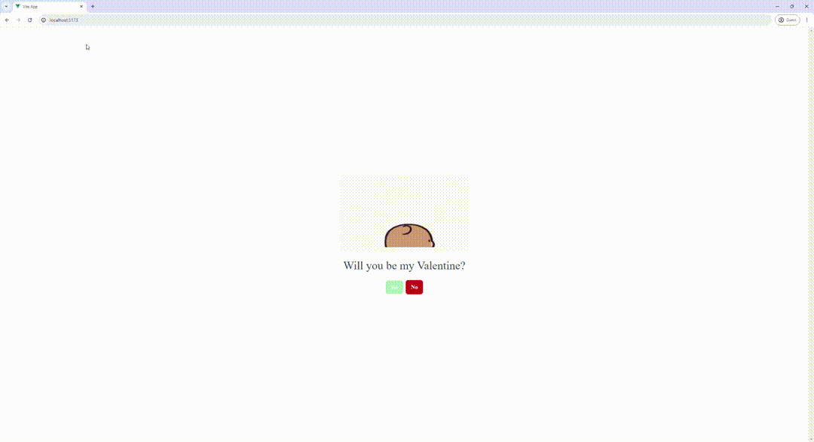
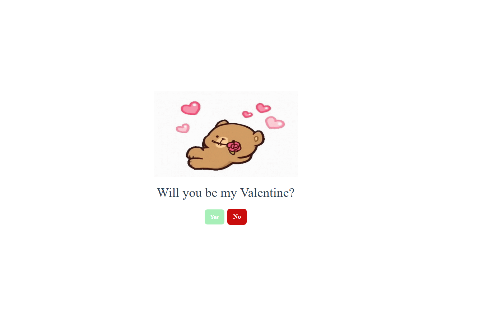
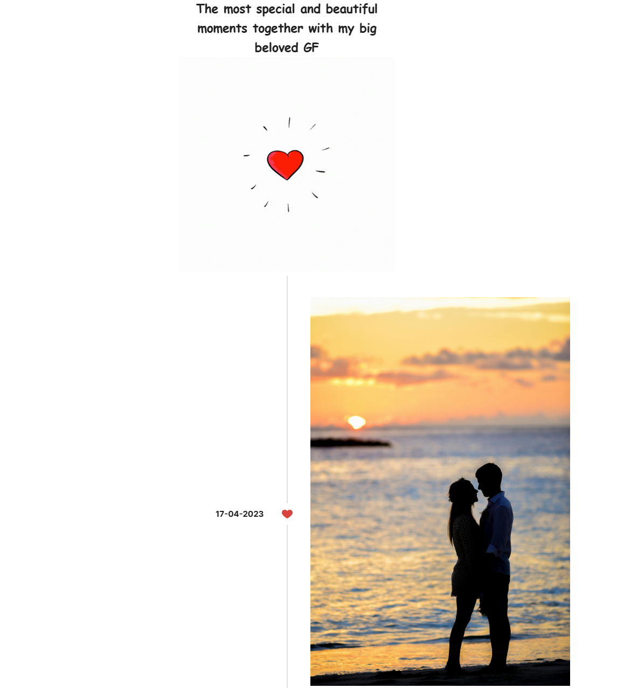

# Valentine-timeline-vue

This template is designed to help you create a beautiful and memorable Valentine's Day gift or a special present for your beloved. With Vue 3 and Vite, you can develop a personalized timeline filled with cherished moments, making it a unique way to show your love and make them happy.


## Project Setup

```sh
npm install
```

### Compile and Hot-Reload for Development

```sh
npm run dev
```

### Type-Check, Compile and Minify for Production

```sh
npm run build
```

### Lint with [ESLint](https://eslint.org/)

```sh
npm run lint
```

## Examples
Capture and share your most precious moments in a beautifully crafted timeline. Whether it's your first date, a special trip, or everyday joy, let each image and note take you back to those heartwarming times.
Create a timeline that tells your love story or celebrates the special people in your life with Valentine-timeline-vue. It's more than a gift; it's a treasure trove of memories.



